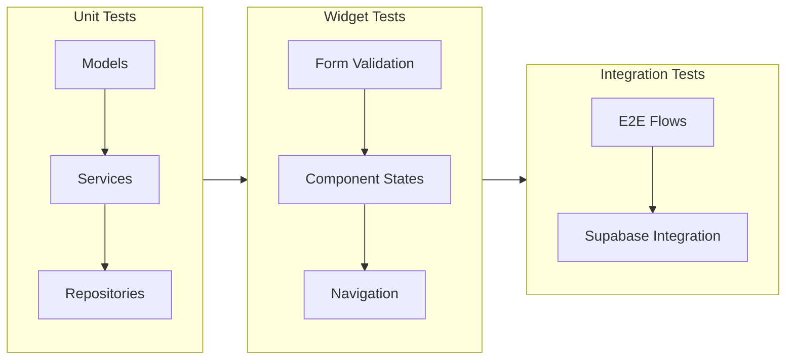

# Waydeck QA Test Plan & Release Guidelines

> **Document Type:** QA & Release Strategy  
> **Version:** 1.0  
> **Last Updated:** 2025-12-07

---

## Table of Contents

1. [Test Plan Overview](#1-test-plan-overview)
2. [Manual Test Cases](#2-manual-test-cases)
3. [Automated Test Strategy](#3-automated-test-strategy)
4. [CI/CD Setup](#4-cicd-setup)
5. [Release Guidelines](#5-release-guidelines)

---

## 1. Test Plan Overview

### 1.1 Scope

This test plan covers the critical user flows for Waydeck MVP:

| Priority | Flow Category | Description |
|----------|---------------|-------------|
| P0 | **Authentication** | Sign up, sign in, sign out, session persistence |
| P0 | **Trip CRUD** | Create, edit, archive/delete trips |
| P0 | **Trip Items** | Add/edit transport, stay, activity, note items |
| P1 | **Timeline** | View timeline, day grouping, layover calculation |
| P1 | **Documents** | Attach/view documents to trips and items |
| P2 | **Offline** | Basic offline caching |

### 1.2 Testing Approach



---

## 2. Manual Test Cases

### 2.1 Authentication Flow

#### TC-AUTH-001: User Sign Up
| Step | Action | Expected Result |
|------|--------|-----------------|
| 1 | Launch app | Splash screen appears, then redirects to Sign In |
| 2 | Tap "Sign Up" link | Navigate to Sign Up screen |
| 3 | Enter valid email, password, confirm password | Fields accept input |
| 4 | Tap "Create Account" | Loading indicator shows |
| 5 | After success | Navigate to Trip List screen |

**Negative Cases:**
- Empty email → Show validation error
- Invalid email format → Show validation error
- Password < 6 characters → Show validation error
- Mismatched passwords → Show validation error

#### TC-AUTH-002: User Sign In
| Step | Action | Expected Result |
|------|--------|-----------------|
| 1 | Launch app | Splash screen redirects to Sign In (if no session) |
| 2 | Enter valid credentials | Fields accept input |
| 3 | Tap "Sign In" | Loading indicator shows |
| 4 | After success | Navigate to Trip List screen |

**Negative Cases:**
- Wrong password → Show error toast "Invalid credentials"
- Non-existent email → Show error toast

#### TC-AUTH-003: Session Persistence
| Step | Action | Expected Result |
|------|--------|-----------------|
| 1 | Sign in successfully | Navigate to Trip List |
| 2 | Kill app completely | App closes |
| 3 | Relaunch app | Splash → Trip List (skip Sign In) |

#### TC-AUTH-004: Sign Out
| Step | Action | Expected Result |
|------|--------|-----------------|
| 1 | Open Profile/Settings | Profile screen appears |
| 2 | Tap "Sign Out" | Confirmation dialog appears |
| 3 | Confirm sign out | Navigate to Sign In screen |
| 4 | Kill and relaunch app | Splash → Sign In (no auto-login) |

---

### 2.2 Trip Management

#### TC-TRIP-001: Create Trip
| Step | Action | Expected Result |
|------|--------|-----------------|
| 1 | On Trip List, tap FAB (+) | Navigate to Create Trip form |
| 2 | Enter "Vietnam & Thailand 2025" as name | Field accepts input |
| 3 | Enter origin city "Pune" | Field accepts input |
| 4 | Select start date: 1 Dec 2025 | Date picker shows, date selected |
| 5 | Select end date: 15 Dec 2025 | Date picker shows, date selected |
| 6 | Tap "Save" | Navigate to Trip Overview |
| 7 | Go back to Trip List | New trip appears at top |

#### TC-TRIP-002: Edit Trip
| Step | Action | Expected Result |
|------|--------|-----------------|
| 1 | On Trip Overview, tap edit (✏️) | Navigate to Edit Trip form |
| 2 | Change name to "Southeast Asia 2025" | Field updates |
| 3 | Tap "Save" | Navigate back, title updated |

#### TC-TRIP-003: Archive Trip
| Step | Action | Expected Result |
|------|--------|-----------------|
| 1 | On Trip List, long press trip card | Context menu appears |
| 2 | Tap "Archive" | Confirmation dialog |
| 3 | Confirm | Trip removed from active list |

#### TC-TRIP-004: Delete Trip
| Step | Action | Expected Result |
|------|--------|-----------------|
| 1 | On Trip Overview, tap overflow menu (⋮) | Menu appears |
| 2 | Tap "Delete" | Confirmation dialog with warning |
| 3 | Confirm | Navigate to Trip List, trip removed |

---

### 2.3 Trip Items

#### TC-ITEM-001: Add Transport Item (Flight)
| Step | Action | Expected Result |
|------|--------|-----------------|
| 1 | On Trip Overview, tap FAB (+) | Action sheet appears |
| 2 | Select "Add Transport" | Navigate to Transport form |
| 3 | Select mode: Flight (✈) | Mode chip selected |
| 4 | Enter carrier: "IndiGo", code: "6E" | Fields accept input |
| 5 | Enter transport number: "5102" | Field accepts input |
| 6 | Enter origin: Pune (PNQ), destination: Mumbai (BOM) | Fields accept input |
| 7 | Set departure: 1 Dec 2025, 08:00 | Date/time pickers work |
| 8 | Set arrival: 1 Dec 2025, 09:15 | Date/time pickers work |
| 9 | Set passenger count: 2 | Stepper works |
| 10 | Tap "Save" | Navigate to Timeline, item appears |

#### TC-ITEM-002: Add Stay Item
| Step | Action | Expected Result |
|------|--------|-----------------|
| 1 | On Trip Overview, tap FAB (+) | Action sheet appears |
| 2 | Select "Add Stay" | Navigate to Stay form |
| 3 | Enter name: "Grand Mercure Da Nang" | Field accepts input |
| 4 | Enter address, city: "Da Nang", country: VN | Fields accept input |
| 5 | Set check-in: 2 Dec 2025, 14:00 | Date/time pickers work |
| 6 | Set check-out: 5 Dec 2025, 11:00 | Date/time pickers work |
| 7 | Toggle "Breakfast included" ON | Checkbox selected |
| 8 | Tap "Save" | Navigate to Timeline, item appears |

#### TC-ITEM-003: Add Activity Item
| Step | Action | Expected Result |
|------|--------|-----------------|
| 1 | On Trip Overview, tap FAB (+) → "Add Activity" | Navigate to Activity form |
| 2 | Enter name: "Ba Na Hills Day Tour" | Field accepts input |
| 3 | Enter category: "tour", city: "Da Nang" | Fields accept input |
| 4 | Set start: 3 Dec 2025, 08:00, end: 17:00 | Times set |
| 5 | Tap "Save" | Item appears in timeline |

#### TC-ITEM-004: Add Note Item
| Step | Action | Expected Result |
|------|--------|-----------------|
| 1 | On Trip Overview, tap FAB (+) → "Add Note" | Navigate to Note form |
| 2 | Enter title: "Buy SIM at BKK" | Field accepts input |
| 3 | Enter description text | Field accepts multi-line input |
| 4 | Tap "Save" | Note appears in timeline |

#### TC-ITEM-005: Edit Item
| Step | Action | Expected Result |
|------|--------|-----------------|
| 1 | Tap on any item in timeline | Navigate to Item Detail |
| 2 | Tap edit (✏️) | Navigate to Edit form |
| 3 | Make changes and save | Changes persisted |

---

### 2.4 Timeline & Layover Calculation

#### TC-TL-001: Day Grouping
| Step | Action | Expected Result |
|------|--------|-----------------|
| 1 | Add items across multiple days | Items created |
| 2 | View Trip Overview | Timeline grouped by day headers |
| 3 | Verify day headers | Format: "Sun, 1 Dec 2025" |

#### TC-TL-002: Layover Display
| Step | Action | Expected Result |
|------|--------|-----------------|
| 1 | Create Flight PNQ → BOM, arrival 09:00 | Flight added |
| 2 | Create Flight BOM → BKK, departure 13:30 | Flight added |
| 3 | View Timeline | "Layover: 4h 30m at BOM" chip between flights |

**Negative Case:**
- Flights to different cities → No layover shown

#### TC-TL-003: Timeline Sorting
| Step | Action | Expected Result |
|------|--------|-----------------|
| 1 | Add items in random order (different times) | Items created |
| 2 | View Timeline | Items sorted chronologically within each day |

---

### 2.5 Documents

#### TC-DOC-001: Attach Document to Trip Item
| Step | Action | Expected Result |
|------|--------|-----------------|
| 1 | Open Transport Detail | Detail screen shown |
| 2 | Tap "Add Document" | File picker opens |
| 3 | Select PDF file | Upload indicator shows |
| 4 | After upload | Document thumbnail appears in grid |

#### TC-DOC-002: View Document
| Step | Action | Expected Result |
|------|--------|-----------------|
| 1 | On Item Detail, tap document thumbnail | Document Viewer opens |
| 2 | View PDF/image | Content displayed correctly |
| 3 | Tap back | Return to Item Detail |

#### TC-DOC-003: Delete Document
| Step | Action | Expected Result |
|------|--------|-----------------|
| 1 | Long press document thumbnail | Delete option appears |
| 2 | Confirm delete | Document removed, storage cleaned |

---

## 3. Automated Test Strategy

### 3.1 Existing Tests

The project already has unit tests for timeline service:

```
test/shared/services/timeline_service_test.dart
```

**Coverage:**
- ✅ `buildTimeline()` - empty input, day grouping, sorting
- ✅ `computeLayover()` - city matching, duration calculation, edge cases
- ✅ `getTotalLayoverDuration()` - multi-segment summation

### 3.2 Recommended Unit Tests

#### 3.2.1 Model Tests

Create: `test/shared/models/trip_test.dart`

```dart
import 'package:flutter_test/flutter_test.dart';
import 'package:waydeck/shared/models/trip.dart';

void main() {
  group('Trip', () {
    test('fromJson creates valid Trip', () {
      final json = {
        'id': '123',
        'owner_id': 'user-1',
        'name': 'Test Trip',
        'origin_city': 'Pune',
        'start_date': '2025-12-01',
        'end_date': '2025-12-15',
        'archived': false,
        'created_at': '2025-12-01T00:00:00Z',
        'updated_at': '2025-12-01T00:00:00Z',
      };

      final trip = Trip.fromJson(json);

      expect(trip.id, '123');
      expect(trip.name, 'Test Trip');
      expect(trip.originCity, 'Pune');
    });

    test('toJson serializes correctly', () {
      final trip = Trip(
        id: '123',
        ownerId: 'user-1',
        name: 'Test Trip',
        createdAt: DateTime(2025, 12, 1),
        updatedAt: DateTime(2025, 12, 1),
      );

      final json = trip.toJson();

      expect(json['name'], 'Test Trip');
      expect(json['owner_id'], 'user-1');
    });

    test('durationDays calculates correctly', () {
      final trip = Trip(
        id: '123',
        ownerId: 'user-1',
        name: 'Test',
        startDate: DateTime(2025, 12, 1),
        endDate: DateTime(2025, 12, 15),
        createdAt: DateTime.now(),
        updatedAt: DateTime.now(),
      );

      expect(trip.durationDays, 14);
    });
  });
}
```

#### 3.2.2 TripItem Model Tests

Create: `test/shared/models/trip_item_test.dart`

```dart
import 'package:flutter_test/flutter_test.dart';
import 'package:waydeck/shared/models/trip_item.dart';
import 'package:waydeck/shared/models/enums.dart';

void main() {
  group('TripItem', () {
    test('localTimeRange formats correctly', () {
      final item = TripItem(
        id: '1',
        tripId: 'trip-1',
        type: TripItemType.transport,
        title: 'Flight',
        startTimeUtc: DateTime(2025, 12, 1, 8, 0),
        endTimeUtc: DateTime(2025, 12, 1, 9, 15),
        createdAt: DateTime.now(),
        updatedAt: DateTime.now(),
      );

      expect(item.localTimeRange, '08:00 – 09:15');
    });

    test('isTransport returns true for transport type', () {
      final item = TripItem(
        id: '1',
        tripId: 'trip-1',
        type: TripItemType.transport,
        title: 'Flight',
        createdAt: DateTime.now(),
        updatedAt: DateTime.now(),
      );

      expect(item.isTransport, isTrue);
      expect(item.isStay, isFalse);
    });
  });

  group('TransportItemDetails', () {
    test('routeString formats origin to destination', () {
      final details = TransportItemDetails(
        mode: TransportMode.flight,
        originCity: 'Pune',
        originAirportCode: 'PNQ',
        destinationCity: 'Mumbai',
        destinationAirportCode: 'BOM',
      );

      expect(details.routeString, 'PNQ → BOM');
    });

    test('durationMinutes calculates correctly', () {
      final details = TransportItemDetails(
        mode: TransportMode.flight,
        departureLocal: DateTime(2025, 12, 1, 8, 0),
        arrivalLocal: DateTime(2025, 12, 1, 9, 30),
      );

      expect(details.durationMinutes, 90);
    });
  });
}
```

#### 3.2.3 Repository Tests (with Mocks)

Create: `test/features/trips/data/trip_repository_test.dart`

```dart
import 'package:flutter_test/flutter_test.dart';
import 'package:mocktail/mocktail.dart';
import 'package:supabase_flutter/supabase_flutter.dart';

// Mock Supabase client for repository tests
class MockSupabaseClient extends Mock implements SupabaseClient {}
class MockGoTrueClient extends Mock implements GoTrueClient {}
class MockUser extends Mock implements User {}

void main() {
  group('TripRepository', () {
    late MockSupabaseClient mockClient;

    setUp(() {
      mockClient = MockSupabaseClient();
    });

    test('getTrips filters by owner_id', () async {
      // Repository implementation should filter by auth.uid()
      // This test would verify the query structure
    });

    test('createTrip includes owner_id', () async {
      // Verify that owner_id is set from current user
    });
  });
}
```

> **Note:** Add `mocktail: ^1.0.4` to dev_dependencies for mocking.

### 3.3 Widget Tests

#### 3.3.1 Create Trip Form Validation

Create: `test/features/trips/widgets/trip_form_test.dart`

```dart
import 'package:flutter/material.dart';
import 'package:flutter_test/flutter_test.dart';
import 'package:flutter_riverpod/flutter_riverpod.dart';

void main() {
  group('CreateTripForm', () {
    testWidgets('shows error when name is empty', (tester) async {
      await tester.pumpWidget(
        const ProviderScope(
          child: MaterialApp(
            home: Scaffold(
              body: CreateTripForm(),
            ),
          ),
        ),
      );

      // Tap save without entering name
      await tester.tap(find.text('Save'));
      await tester.pumpAndSettle();

      expect(find.text('Trip name is required'), findsOneWidget);
    });

    testWidgets('end date cannot be before start date', (tester) async {
      // Test date validation logic
    });
  });
}
```

#### 3.3.2 Timeline Widget Tests

Create: `test/features/trip_items/widgets/timeline_widget_test.dart`

```dart
import 'package:flutter/material.dart';
import 'package:flutter_test/flutter_test.dart';
import 'package:waydeck/shared/models/models.dart';

void main() {
  group('TimelineWidget', () {
    testWidgets('displays day headers', (tester) async {
      final days = [
        TimelineDay(
          date: DateTime(2025, 12, 1),
          dateLabel: 'Sun, 1 Dec 2025',
          entries: [],
        ),
      ];

      // Pump widget and verify day header is shown
      expect(find.text('Sun, 1 Dec 2025'), findsOneWidget);
    });

    testWidgets('displays layover chip between transports', (tester) async {
      // Verify layover entry renders correctly
    });
  });
}
```

### 3.4 Running Tests

```bash
# Run all unit and widget tests
flutter test

# Run with coverage
flutter test --coverage

# Run specific test file
flutter test test/shared/services/timeline_service_test.dart

# Run tests matching a pattern
flutter test --name "layover"
```

---

## 4. CI/CD Setup

### 4.1 GitHub Actions Workflow

Create: `.github/workflows/flutter-ci.yml`

```yaml
name: Flutter CI

on:
  push:
    branches: [main, develop]
  pull_request:
    branches: [main, develop]

env:
  FLUTTER_VERSION: "3.24.0"

jobs:
  # -------------------------------------------
  # Job 1: Analyze and Test
  # -------------------------------------------
  analyze-and-test:
    name: Analyze & Test
    runs-on: ubuntu-latest
    
    steps:
      - name: Checkout code
        uses: actions/checkout@v4

      - name: Setup Flutter
        uses: subosito/flutter-action@v2
        with:
          flutter-version: ${{ env.FLUTTER_VERSION }}
          channel: stable
          cache: true

      - name: Get dependencies
        run: flutter pub get

      - name: Generate code (freezed, json_serializable)
        run: dart run build_runner build --delete-conflicting-outputs

      - name: Create .env file
        run: |
          echo "SUPABASE_URL=${{ secrets.SUPABASE_URL }}" > .env
          echo "SUPABASE_ANON_KEY=${{ secrets.SUPABASE_ANON_KEY }}" >> .env

      - name: Analyze code
        run: flutter analyze --fatal-infos

      - name: Run tests
        run: flutter test --coverage

      - name: Upload coverage to Codecov
        uses: codecov/codecov-action@v4
        with:
          file: coverage/lcov.info
          fail_ci_if_error: false

  # -------------------------------------------
  # Job 2: Build Android APK (on main only)
  # -------------------------------------------
  build-android:
    name: Build Android APK
    runs-on: ubuntu-latest
    needs: analyze-and-test
    if: github.ref == 'refs/heads/main'
    
    steps:
      - name: Checkout code
        uses: actions/checkout@v4

      - name: Setup Java
        uses: actions/setup-java@v4
        with:
          distribution: 'temurin'
          java-version: '17'

      - name: Setup Flutter
        uses: subosito/flutter-action@v2
        with:
          flutter-version: ${{ env.FLUTTER_VERSION }}
          channel: stable
          cache: true

      - name: Get dependencies
        run: flutter pub get

      - name: Generate code
        run: dart run build_runner build --delete-conflicting-outputs

      - name: Create .env file (prod)
        run: |
          echo "SUPABASE_URL=${{ secrets.SUPABASE_URL_PROD }}" > .env
          echo "SUPABASE_ANON_KEY=${{ secrets.SUPABASE_ANON_KEY_PROD }}" >> .env

      - name: Build APK (release)
        run: flutter build apk --release

      - name: Upload APK artifact
        uses: actions/upload-artifact@v4
        with:
          name: waydeck-release-apk
          path: build/app/outputs/flutter-apk/app-release.apk

  # -------------------------------------------
  # Job 3: Build iOS IPA (macOS runner required)
  # -------------------------------------------
  build-ios:
    name: Build iOS
    runs-on: macos-latest
    needs: analyze-and-test
    if: github.ref == 'refs/heads/main'
    
    steps:
      - name: Checkout code
        uses: actions/checkout@v4

      - name: Setup Flutter
        uses: subosito/flutter-action@v2
        with:
          flutter-version: ${{ env.FLUTTER_VERSION }}
          channel: stable
          cache: true

      - name: Get dependencies
        run: flutter pub get

      - name: Generate code
        run: dart run build_runner build --delete-conflicting-outputs

      - name: Create .env file (prod)
        run: |
          echo "SUPABASE_URL=${{ secrets.SUPABASE_URL_PROD }}" > .env
          echo "SUPABASE_ANON_KEY=${{ secrets.SUPABASE_ANON_KEY_PROD }}" >> .env

      - name: Build iOS (no codesign for CI)
        run: flutter build ios --release --no-codesign

      - name: Upload iOS build
        uses: actions/upload-artifact@v4
        with:
          name: waydeck-ios-build
          path: build/ios/iphoneos
```

### 4.2 Required GitHub Secrets

Configure these secrets in GitHub repository settings:

| Secret Name | Environment | Description |
|-------------|-------------|-------------|
| `SUPABASE_URL` | Dev/Test | Supabase project URL for CI tests |
| `SUPABASE_ANON_KEY` | Dev/Test | Anon key for CI tests |
| `SUPABASE_URL_PROD` | Production | Production Supabase URL |
| `SUPABASE_ANON_KEY_PROD` | Production | Production anon key |

> [!CAUTION]
> Never commit `.env` files or expose `service_role` keys. Only use `anon` keys in the mobile app.

---

## 5. Release Guidelines

### 5.1 Environment Configuration

#### 5.1.1 Build Flavors

Set up three environments with distinct configurations:

| Flavor | App ID Suffix | Supabase Project | Use Case |
|--------|---------------|------------------|----------|
| **dev** | `.dev` | waydeck-dev | Local development |
| **stage** | `.stage` | waydeck-staging | QA testing |
| **prod** | (none) | waydeck-prod | Production release |

#### 5.1.2 App IDs by Flavor

| Platform | Dev | Stage | Prod |
|----------|-----|-------|------|
| Android | `com.waydeck.waydeck.dev` | `com.waydeck.waydeck.stage` | `com.waydeck.waydeck` |
| iOS | `com.waydeck.waydeck.dev` | `com.waydeck.waydeck.stage` | `com.waydeck.waydeck` |

#### 5.1.3 Environment Files

Create separate `.env` files:

```bash
# .env.dev
SUPABASE_URL=https://xxx-dev.supabase.co
SUPABASE_ANON_KEY=eyJ...dev

# .env.stage
SUPABASE_URL=https://xxx-stage.supabase.co
SUPABASE_ANON_KEY=eyJ...stage

# .env.prod
SUPABASE_URL=https://xxx-prod.supabase.co
SUPABASE_ANON_KEY=eyJ...prod
```

### 5.2 Release Build Checklist

#### Android Release

- [ ] **1. Version Update**
  ```yaml
  # pubspec.yaml
  version: 1.0.0+1  # Update version and build number
  ```

- [ ] **2. Signing Configuration**
  - Create `android/key.properties`:
    ```properties
    storePassword=<password>
    keyPassword=<password>
    keyAlias=waydeck
    storeFile=../keystore/waydeck-release.jks
    ```
  - Update `android/app/build.gradle.kts`:
    ```kotlin
    signingConfigs {
        create("release") {
            val keystoreProperties = Properties()
            keystoreProperties.load(FileInputStream(file("../key.properties")))
            keyAlias = keystoreProperties["keyAlias"] as String
            keyPassword = keystoreProperties["keyPassword"] as String
            storeFile = file(keystoreProperties["storeFile"] as String)
            storePassword = keystoreProperties["storePassword"] as String
        }
    }
    buildTypes {
        release {
            signingConfig = signingConfigs.getByName("release")
            isMinifyEnabled = true
            proguardFiles(...)
        }
    }
    ```

- [ ] **3. Generate Release Bundle**
  ```bash
  flutter build appbundle --release
  ```

- [ ] **4. Test Release Build**
  ```bash
  flutter install --release
  ```

- [ ] **5. Upload to Play Console**
  - Upload `build/app/outputs/bundle/release/app-release.aab`
  - Complete store listing
  - Submit for review

#### iOS Release

- [ ] **1. Version Update** (same as Android)

- [ ] **2. Xcode Configuration**
  - Open `ios/Runner.xcworkspace` in Xcode
  - Select correct Team and Bundle Identifier
  - Ensure "Automatically manage signing" is checked
  - Update version/build in Xcode if needed

- [ ] **3. Archive Build**
  ```bash
  flutter build ipa --release
  ```

- [ ] **4. Upload to App Store Connect**
  - Use Xcode Organizer → Distribute App → App Store Connect
  - Or use `xcrun altool` CLI

- [ ] **5. Complete App Store Listing**
  - Screenshots (iPhone 6.5", 5.5"; iPad 12.9", if applicable)
  - App description, keywords, support URL
  - Privacy policy URL

### 5.3 Pre-Release Verification

```bash
# 1. Clean build
flutter clean
flutter pub get
dart run build_runner build --delete-conflicting-outputs

# 2. Run all tests
flutter test

# 3. Analyze code
flutter analyze

# 4. Build release (Android)
flutter build apk --release

# 5. Build release (iOS)
flutter build ios --release

# 6. Test on physical devices
flutter install --release  # Android
# For iOS: Use TestFlight or direct install via Xcode
```

### 5.4 Post-Release Monitoring

- [ ] Monitor Supabase dashboard for errors
- [ ] Check app store crash reports (Play Console / App Store Connect)
- [ ] Verify auth flow works on fresh install
- [ ] Confirm document uploads succeed
- [ ] Test on low-network conditions

---

## Appendix: Test Command Quick Reference

```bash
# Unit & Widget Tests
flutter test                              # Run all tests
flutter test --coverage                   # With coverage
flutter test test/path/to/file_test.dart  # Specific file

# Integration Tests
flutter test integration_test/            # Run integration tests (if added)

# Analyze
flutter analyze                           # Check for issues
flutter analyze --fatal-warnings          # Fail on warnings

# Build
flutter build apk --debug                 # Debug APK
flutter build apk --release               # Release APK
flutter build appbundle --release         # Play Store bundle
flutter build ios --release --no-codesign # iOS build (CI)
flutter build ipa --release               # iOS archive

# Clean
flutter clean                             # Remove build artifacts
```
